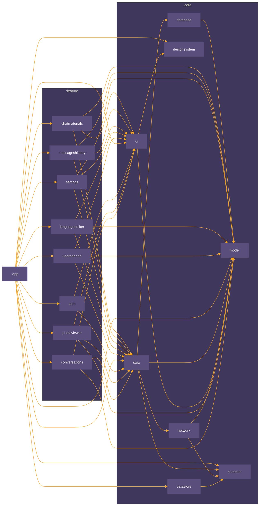

### Module Graph

```mermaid
%%{
  init: {
    'theme': 'base',
    'themeVariables': {"primaryTextColor":"#fff","primaryColor":"#5a4f7c","primaryBorderColor":"#5a4f7c","lineColor":"#f5a623","tertiaryColor":"#40375c","fontSize":"12px"}
  }
}%%

graph LR
  subgraph :core
    :core:database["database"]
    :core:model["model"]
    :core:data["data"]
    :core:ui["ui"]
    :core:common["common"]
    :core:designsystem["designsystem"]
    :core:datastore["datastore"]
    :core:network["network"]
  end
  subgraph :feature
    :feature:chatmaterials["chatmaterials"]
    :feature:messageshistory["messageshistory"]
    :feature:settings["settings"]
    :feature:languagepicker["languagepicker"]
    :feature:userbanned["userbanned"]
    :feature:auth["auth"]
    :feature:conversations["conversations"]
    :feature:photoviewer["photoviewer"]
  end
  :core:database --> :core:model
  :feature:chatmaterials --> :core:data
  :feature:chatmaterials --> :core:model
  :feature:chatmaterials --> :core:ui
  :feature:messageshistory --> :core:data
  :feature:messageshistory --> :core:model
  :feature:messageshistory --> :core:ui
  :feature:settings --> :core:data
  :feature:settings --> :core:model
  :feature:settings --> :core:ui
  :feature:languagepicker --> :core:data
  :feature:languagepicker --> :core:model
  :feature:languagepicker --> :core:ui
  :feature:userbanned --> :core:data
  :feature:userbanned --> :core:model
  :feature:userbanned --> :core:ui
  :app --> :feature:auth
  :app --> :feature:chatmaterials
  :app --> :feature:conversations
  :app --> :feature:languagepicker
  :app --> :feature:messageshistory
  :app --> :feature:photoviewer
  :app --> :feature:settings
  :app --> :feature:userbanned
  :app --> :core:common
  :app --> :core:ui
  :app --> :core:designsystem
  :app --> :core:data
  :app --> :core:model
  :app --> :core:datastore
  :core:data --> :core:common
  :core:data --> :core:model
  :core:data --> :core:network
  :core:data --> :core:database
  :core:network --> :core:common
  :core:network --> :core:model
  :feature:auth --> :core:data
  :feature:auth --> :core:ui
  :core:ui --> :core:designsystem
  :core:ui --> :core:model
  :feature:photoviewer --> :core:data
  :feature:photoviewer --> :core:model
  :feature:photoviewer --> :core:ui
  :feature:conversations --> :core:data
  :feature:conversations --> :core:model
  :feature:conversations --> :core:ui
  :core:datastore --> :core:common
```
# fast-messenger
 
Unofficial messenger for russian social network VKontakte